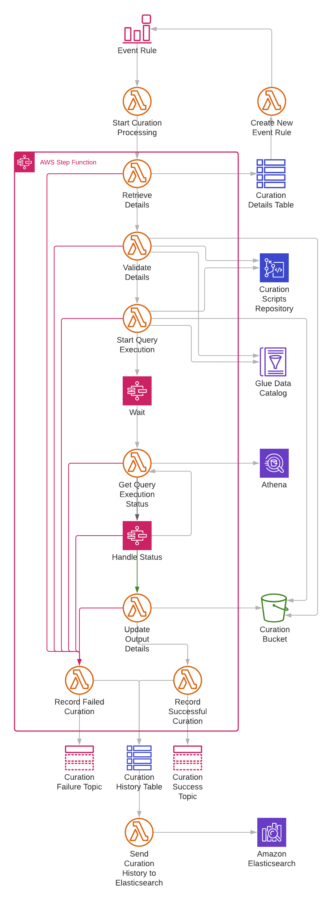

# Accelerated Data Pipelines

A packaged solution, that builds a highly functional Data Pipeline Framework ready to use with your Data Lake, with the option to push data to your data catalog queryable via Elasticsearch.

## Why the accelerated data pipelines was created

From talking with customers who use the accelerated data lake as the foundation for their data lake, once they are able to query the data within their staged data via Athena their eyes light up with the possibilities of extracting, joining and reporting using the data now available to them. 

Organisations, now with a wealth of data at their fingertips are able to start creating tangible benefit through the use of this data.
These organisations look for a way to automate the filtering, joining and selecting using their newly acquired data lake. These automations are usually made up of a basic lambda function configured for a specific use case that didn't allow much flexibility or reusability, and the infrastucture to support was held together with duct-tape.

Thus the accelerated data pipelines was created, with the ability to define a curation, the metadata and tags attached to the output file, renaming the output with a custom filename, automatically configuring the event schedule for when it should run, the ability to audit and see history of queries all while using the familiar tools and framework of the Accelerated Data Lake.

## Purpose

The purpose of this package is to extend the [accelerated data lake](https://github.com/aws-samples/accelerated-data-lake) solution to add the functionality to run queies via Amazon Athena on your Glue tables on a scheduled basis.
The platform also keeps an audit trail of when and what curation has ran for debugging purposes
The pipeline allows the user to define everything about the output of the curation from the metadata and tags to be attached to the filename and S3 bucket for it to be placed within.

## Benefits
* Run athena queries on a scheduled basis to a defined output location
* Integrates seamlessly with your existing Glue catalog
* Automatically creates scheduled events in EventBridge
* Record successful and failed curations in the Curation History DynamoDB table
* Track history of sql script changes using CodeCommit
* Error Notification via SNS
* Supports long running queries (>15 minutes)
* Add custom metadata and tags to the output file
* Ability to rename the output file
* Stream events to existing Kibana Dashboard

## What is created:
* 1 CodeCommit repository used for storing sql scripts
* 2 DynamoDB tables used to store details about the curation and to store the history of the curation (success and failure and the details used)
* 1 Step Function used to manage and coordinate the pipelines
* 8 Lambda Functions used with the step function to coordinate the running of the query
* 1 Lambda Function to stream new entries to event bridge to create the trigger
* 1 Lambda Function to stream successful and failed events to the elasticsearch cluster

## License

This library is licensed under the Apache 2.0 License. 

# Accelerated Data Pipeline installation instructions
These are the steps required to provision the Data pipeline Solution and watch the ingress of data.
* Provision the Required Storage Structure (5 minutes)
* Provision the Curation Engine (5 minutes)
* Provision the Stream Schedules (5 minutes)
* Provision Visualisation Lambdas (5 minutes)
* Configure a sample curation entry and sample sql (5 minutes)
    * Upload curation script to CodeCommit (5 minutes)
    * Creating Curation Type in CurationDetails DynamoDB Table (5 minutes)
    * Initialise and use Elasticsearch / Kibana (5 minutes)

## 1. Provisioning the Storage Structure
* Go to the CloudFormation section of the AWS Console.
* Think of an environment prefix . This prefix will make your S3 buckets globally unique (so it must be lower case) and wil help identify your components - a good example is: wildrydes-dev-
* Create a new stack using the template `/CurationStorageStructure/curationStorageStructure.yml` 
* Enter the stack name. For example: `wildrydes-dev-curation-structure`
* Enter the environment prefix, in this case: `wildrydes-dev-`
* Add a KMS Key ARN if you want your S3 Buckets encrypted (recommended - also, there are further improvements with other encryption options imminent in this area)
* All other options are self explanatory, and the defaults are acceptable when testing the solution.
* If you would like to use an existing curation or logs bucket, you will have to alter the yml of both the storage structure and the curation engine.

## 2. Provisioning the Curation Engine
This is the core engine for the data pipelines - it creates lambdas and a step function, that takes the entry details from a dynamodb table, verifies that it will be able to query the data, updates the output with a filename, tags and metadata.

On both success and failure, the engine will updates the curationHistory table in DynamoDB. Allowing users to see the full history of all the attempted curations and see what output files are and the details used to generate this.

Execution steps:
(ignore these steps if already done in the visualisation step)
* Create a IAM user, with CLI access.
* Configure the AWS CLI with the user's access key and secret access key.
* Install AWS SAM.
(mandatory steps)
* Open a terminal / command line and move to the CurationEngine/ folder
* Execute the AWS SAM package and deploy commands:

For this example, the commands should be:
````
sam package --template-file ./curationEngine.yml --output-template-file curationEngineDeploy.yml --s3-bucket wildrydes-dev-accelerated-data-pipelines-codepackages

sam deploy --template-file curationEngineDeploy.yml --stack-name wildrydes-dev-curation-engine --capabilities CAPABILITY_NAMED_IAM --parameter-overrides EnvironmentPrefix=wildrydes-dev-
````

## 3. Provisioning the Schedule Stream
This is the schedule stream, any creation or alteration of an entry in the curationDetails dynamodb table will be streamed to a lambda function that add or updates the event rule used in the curation engine using the cron expression defined in the entry.

Execution steps:
(ignore these steps if already done in the visualisation step)
* Create a IAM user, with CLI access.
* Configure the AWS CLI with the user's access key and secret access key.
* Install AWS SAM.
(mandatory steps)
* Open a terminal / command line and move to the StreamSchedules/ folder
* Execute the AWS SAM package and deploy commands:

For this example, the commands should be:
````
sam package --template-file ./scheduleSetup.yml --output-template-file scheduleSetupDeploy.yml --s3-bucket wildrydes-dev-accelerated-data-pipelines-codepackages

sam deploy --template-file scheduleSetupDeploy.yml --stack-name wildrydes-dev-schedule-streams --capabilities CAPABILITY_NAMED_IAM --parameter-overrides EnvironmentPrefix=wildrydes-dev-
````

## 4. Provisioning the Visualisation Lambdas
This step creates a lambda which is triggered by changes to the curation details DynamoDB table. The lambda takes the changes and sends them to the elasticsearch cluster created in the accelerated data lake.

Execution steps:
(ignore these steps if already done in the visualisation step)
* Create a IAM user, with CLI access.
* Configure the AWS CLI with the user's access key and secret access key.
* Install AWS SAM.
(mandatory steps)
* Open a terminal / command line and move to the StreamSchedules/ folder
* Execute the AWS SAM package and deploy commands:

For this example, the commands should be:
````
sam package --template-file ./visualisation.yml --output-template-file visualisationDeploy.yml --s3-bucket wildrydes-dev-visualisationcodepackages

sam deploy --template-file visualisationDeploy.yml --stack-name wildrydes-dev-elasticsearch-lambdas --capabilities CAPABILITY_NAMED_IAM --parameter-overrides EnvironmentPrefix=wildrydes-dev-
````

Congratulations! The Accelerated Data Pipeline is now fully provisioned! Now let's configure a curation detail and some sample query.

## 5. Creating a sample curation
---

**NOTE**
These next steps assume you have a glue database (wildrydes) and table (rydebookings) created from the accelerated data lake example, feel free to update these values with your own database and table in the `DataSources/rydebooking-curation.sql` and `ddbCurationDetailsConfig.json` files.

---

### 5.1 Configure a curation script
Execution steps:
* Open the file `DataSources/rydebooking-curation.sql`
* Copy the file's contents to the clipboard.
* Go into the AWS Console, CodeCommit.
* Open the CodeCommit repository, which for the environment prefix used in this demonstration will be: `wildrydes-dev-curation-scripts`
* Click `Add File` then `Create File`
* Paste in the contents of the `DataSources/rydebooking-curation.sql` file into the top text box
* Name the file `wildrydes/rydebooking-curation.sql`
* Fill in your name 
* Fill in your email address
* Click `Commit Changes`

You have now uploaded your curation script to the code commit repository

### 5.2 Configure the sample data source
Execution steps:
* Open the file `DataSources/ddbCurationDetailsConfig.json`
* Copy the file's contents to the clipboard.
* Go into the AWS Console, DynamoDB screen.
* Open the DataSource table, which for the environment prefix used in this demonstration will be: `wildrydes-dev-curationDetails`
* Go to the Items tab, click Create Item, switch to 'Text' view and paste in the contents of the `ddbCurationDetailsConfig.json` file. 
* Save the item.

You now have a fully configured your curationType.

### 5.3 Initialise and use Elasticsearch / Kibana
The above steps will have resulted in the rydebookings curation being entered into the DynamoDB curation history table (`wildrydes-dev-curationHistory`). The visualisation steps subscribed to these table's stream and all updates are now sent to elasticsearch.

The data will already be in elasticsearch, we just need to create a suitable index.

Execution steps:

* Go to the kibana url (found in the AWS Console, under elasticsearch)
* You will see there is no data - this is because the index needs to be created (the data is present, so we will let kibana auto-create it)
* Click on the management tab, on the left.
* Click "Index Patterns"
* Paste in: `wildrydes-dev-curationHistory` (so <ENVIRONMENT_PREFIX>curationHistory). You will see this name in the available index patterns at the base of the screen.
* Click "Next step"
* Select `@Timestamp` in the "Time Filter field name" field - this is very important, otherwise you will not get the excellent kibana timeline.
* Click "Create Index Pattern" and the index will be created. Click on the Discover tab to see your data catalog and details of your failed and successful ingress.

# Architecture


# Additional Resources
* https://github.com/aws-samples/accelerated-data-lake
